# IKB42603 Lab 0: Environment Setup Report

**Course:** IKB42603 Cloud Computing Security Essentials  
**Lab:** Lab 0 – Environment Setup  
**Student Name:** Nur Shafiqa Binti Ab Rahim  
**Student ID:** 52215124832  
**Date:** 31/7/20  
**Environment:** Windows 11

## Objective

The objective of this lab is to prepare a local workstation for the Cloud Computing Security Essentials course. The required software was installed and verified so that the computer is ready for Docker, LocalStack, AWS CLI, Kubernetes, and security-related laboratory activities.

## Environment Summary

The following software and tools were prepared successfully. Supporting screenshots are stored in the `Evidence/` folder.

| Component | Verification command | Evidence file |
| --- | --- | --- |
| Docker Desktop | `docker --version` and `docker run --rm hello-world` | `docker-version-and-hello-world.png` |
| Chocolatey | `choco --version` | `chocolatey-version.png` |
| AWS CLI Version 2 | `aws --version` | `aws-cli-version.png` |
| kind | `kind --version` | `kind-version.png` |
| kubectl | `kubectl version --client` | `kubectl-version.png` |
| OpenSSL | `openssl version` | `helper-tools.png` |
| oathtool | `oathtool --version` | `oathtool-version.png` |
| LocalStack | `curl http://localhost:4566/_localstack/health` | `localstack-container-and-health.png` |
| LocalStack AWS CLI | `aws $EP sts get-caller-identity` | `aws-cli-localstack-sts.png` |

## Tool Installations and Verification

### Chocolatey

Chocolatey is a Windows package manager used to install kind and kubectl.

```powershell
choco --version
```

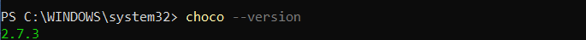

### Docker Desktop

Docker provides the container platform required to run LocalStack and other container-based services.

1. Download Docker Desktop for Windows from the official Docker website.
2. Run the installer and select **Use WSL 2 instead of Hyper-V** when prompted.
3. Restart the computer if required.
4. Open Docker Desktop and wait until the engine is running.
5. Open Git Bash or PowerShell and verify Docker:

   ```bash
   docker --version
   docker run --rm hello-world
   ```

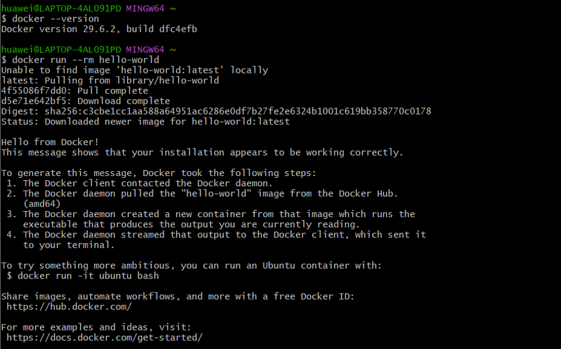

### AWS CLI Version 2

AWS CLI is used to run AWS commands. In this lab, it communicates with LocalStack rather than a real AWS account.

1. Download the AWS CLI Version 2 installer for Windows from the official AWS website.
2. Run the MSI installer using the default settings.
3. Open a new Git Bash or PowerShell window.
4. Verify the installation:

   ```bash
   aws --version
   ```

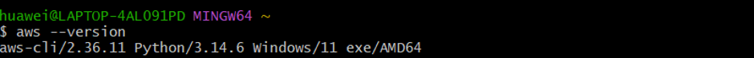

### kind

kind (Kubernetes IN Docker) creates local Kubernetes clusters using Docker.

1. Open PowerShell as Administrator.
2. Install kind using Chocolatey:

   ```powershell
   choco install kind --ignore-dependencies -y
   ```

3. Open a new terminal and verify the installation:

   ```bash
   kind --version
   ```

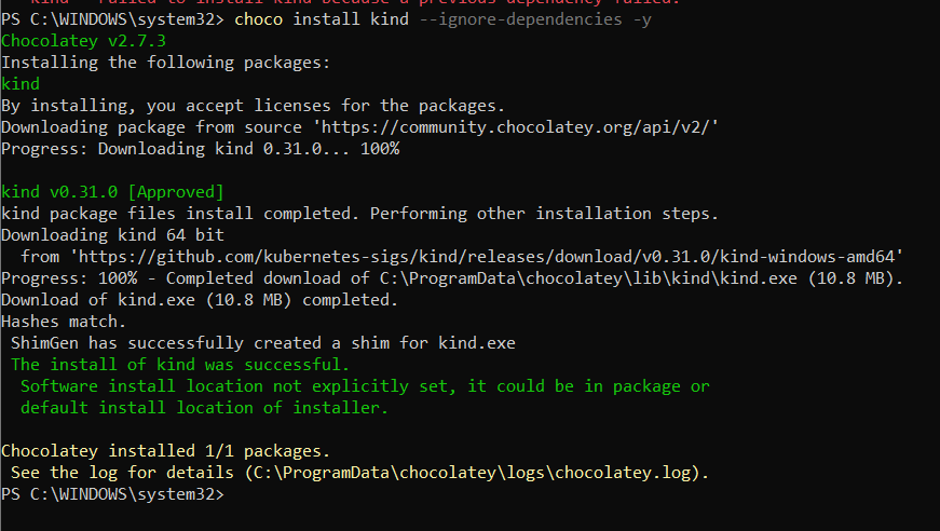

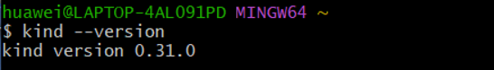

### kubectl

`kubectl` is the command-line client used to manage Kubernetes clusters.

1. Open PowerShell as Administrator.
2. Install kubectl using Chocolatey:

   ```powershell
   choco install kubernetes-cli -y
   ```

3. Open a new terminal and verify the installation:

   ```bash
   kubectl version --client
   ```

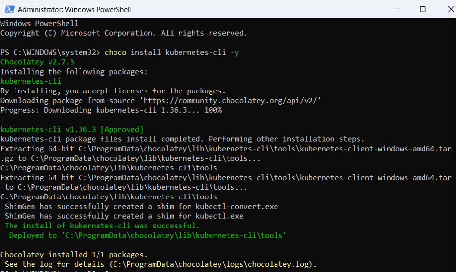

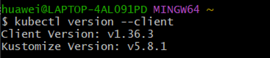

### Helper Tools

OpenSSL is used for cryptographic operations, while oathtool supports one-time password (MFA/TOTP) activities in later laboratory tasks.

1. Open Git Bash.
2. Check that OpenSSL is available:

   ```bash
   openssl version
   ```

3. Open Ubuntu through WSL and verify oathtool:

   ```bash
   oathtool --version
   ```

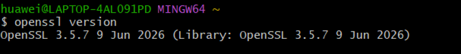

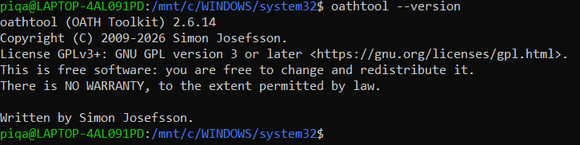

## Start and Verify LocalStack

**Purpose:** LocalStack simulates AWS services locally so that lab exercises can be tested without a live cloud account. It provides a safe and isolated environment for AWS CLI practice.

### Commands Used

```bash
docker run --rm -d --name localstack -p 4566:4566 localstack/localstack:3.0
curl http://localhost:4566/_localstack/health
docker ps
```

### Evidence

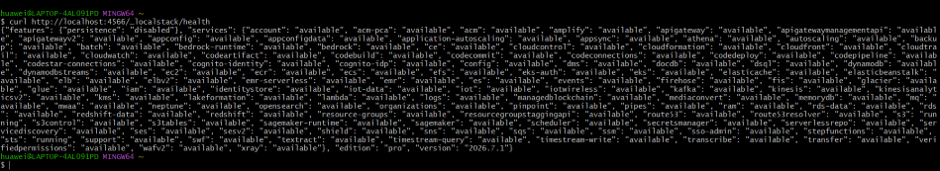

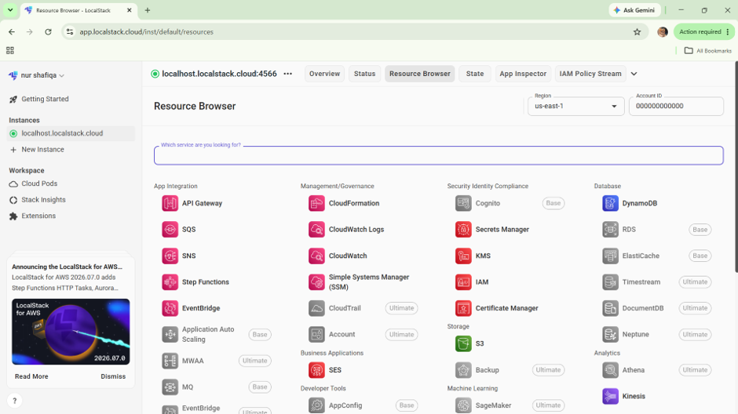


## AWS CLI Configuration for LocalStack

The following dummy credentials are used only for LocalStack. They do not provide access to a real AWS account.

1. Configure the AWS CLI:

   ```bash
   aws configure set aws_access_key_id test
   aws configure set aws_secret_access_key test
   aws configure set default.region us-east-1
   aws configure set default.output json
   ```

2. Set the LocalStack endpoint for the current terminal session:

   ```bash
   EP='--endpoint-url=http://localhost:4566'
   ```

3. Verify that AWS CLI communicates with LocalStack:

   ```bash
   aws $EP sts get-caller-identity
   ```


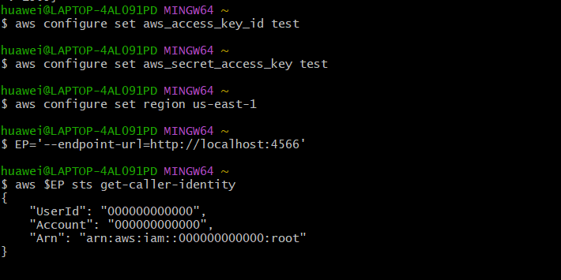

## Pre-Lab Verification Checklist

| Check | Status |
| --- | --- |
| Docker Desktop installed and working | Completed |
| AWS CLI Version 2 installed | Completed |
| kind installed | Completed |
| kubectl installed | Completed |
| OpenSSL verified | Completed |
| oathtool verified | Completed |
| LocalStack healthy | Completed |
| AWS CLI communicates with LocalStack | Completed |

## Conclusion

The required software and supporting tools were successfully installed and verified. Docker Desktop, AWS CLI Version 2, LocalStack, kind, kubectl, and OpenSSL are functioning correctly. The local environment is ready for the remaining Cloud Computing Security Essentials laboratory activities.
